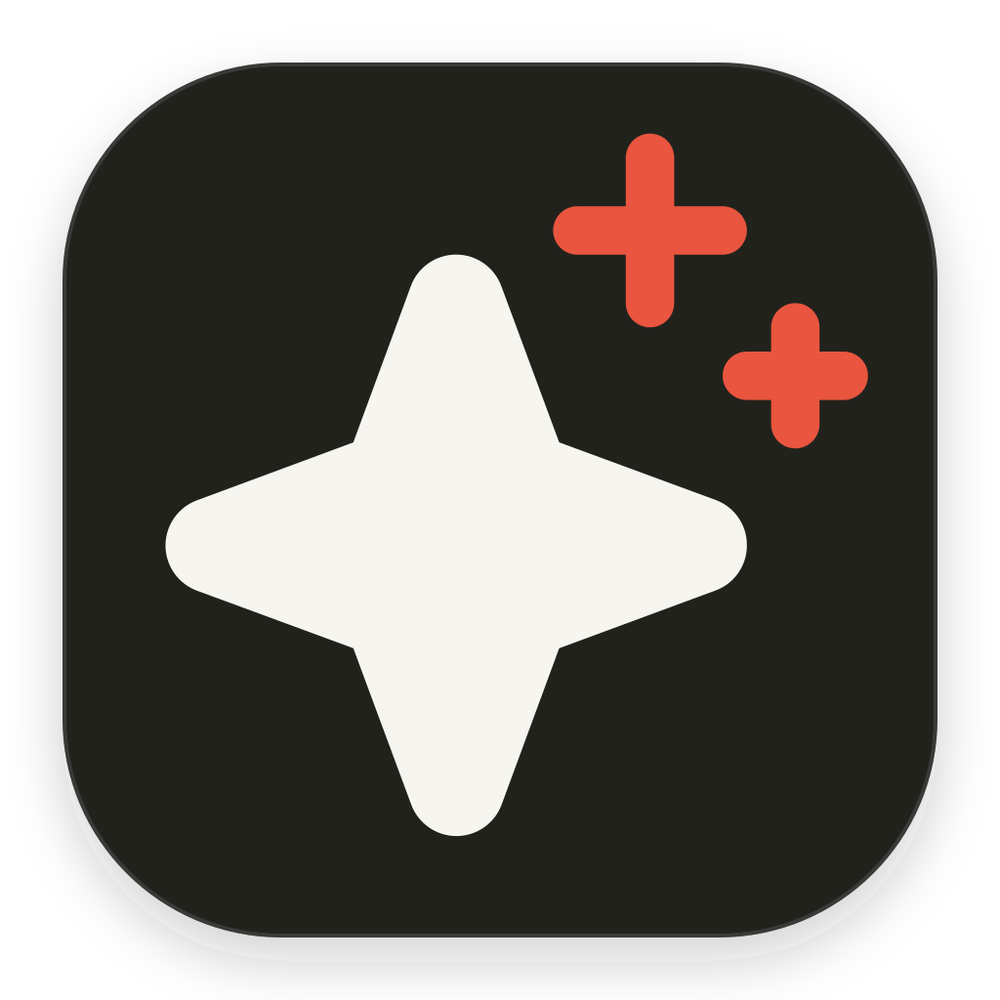
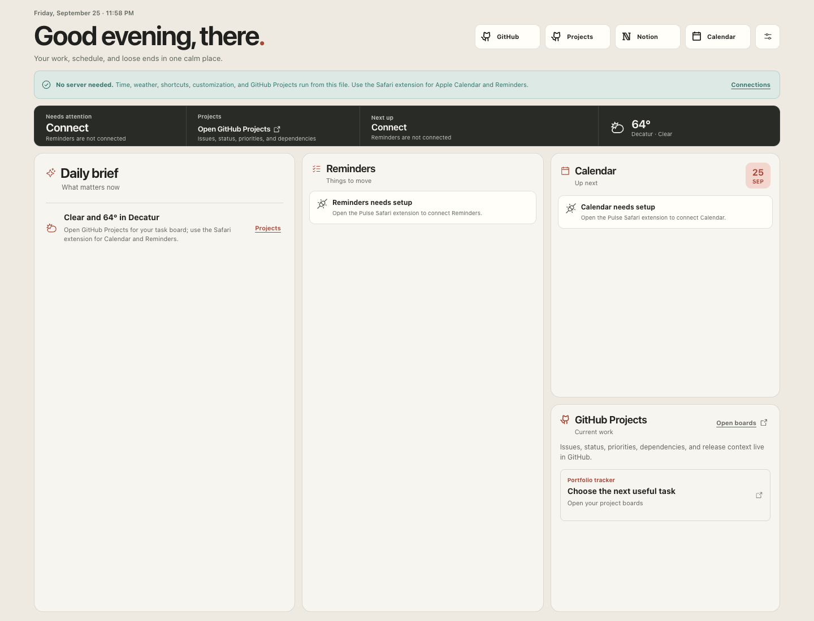
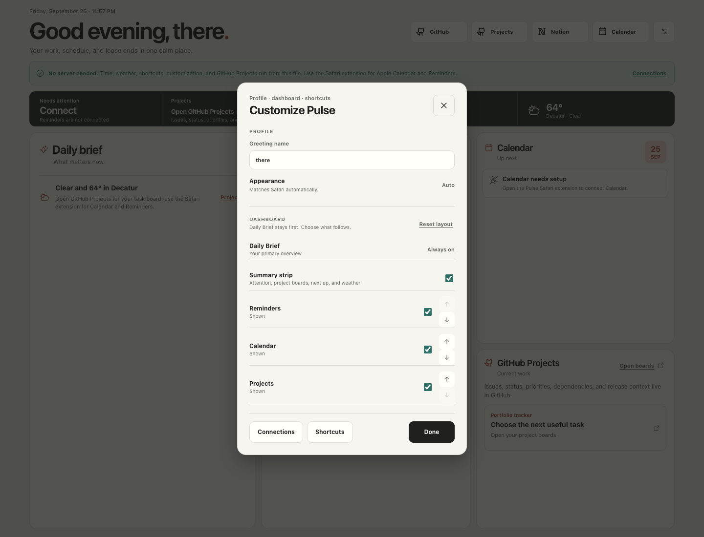

<p align="center">
  
</p>

<h1 align="center">Pulse</h1>

<p align="center">
  A server-free Safari homepage for the work that matters now.
</p>

<p align="center">
  <a href="LICENSE"></a>
  
  
  
</p>

<p align="center">
  
</p>

Pulse turns every new Safari tab into a concise daily brief. It combines your next commitment, Apple Reminders, Calendar, a direct link to GitHub Projects, weather, and editable shortcuts in one calm screen—without a localhost process, hosted backend, or background daemon.

## What you get

- **Daily Brief first.** The most useful summary is placed where you look first.
- **Apple-native actions.** See Calendar events, review Reminders, and mark reminders complete without leaving the page.
- **GitHub Projects at a glance.** Open the project boards where issue status, priority, dependencies, and release context live.
- **Shortcuts that are actually yours.** Add, remove, and reorder the links you use every day.
- **A dashboard that adapts to you.** Change the greeting name, show or hide the summary and widgets, and reorder Reminders, Calendar, and Projects.
- **One-screen density.** The desktop dashboard is designed to fit a Safari viewport without vertical scrolling.
- **System-aware polish.** Light and dark modes follow Safari automatically, with source-shaped skeleton states while native data loads.
- **Local-first architecture.** Pulse opens GitHub in Safari and stores no GitHub credentials; Apple data stays behind the native EventKit bridge.

<p align="center">
  
</p>

## Download and use it

### Standalone homepage — no developer tools

[**Download the latest `pulse-homepage.html` →**](https://github.com/henryvn27/pulse-homepage/releases/latest/download/pulse-homepage.html)

The standalone file includes time, weather, a GitHub Projects link, shortcuts, the editable greeting, and widget customization. Open it directly in Safari and use its `file://` address as your Safari homepage. GitHub authentication stays on GitHub; Pulse never requests a token. Apple Calendar and Reminders require the native extension below because normal webpages cannot access EventKit.

No server, terminal, or installation process is required. The file contains its own JavaScript, CSS, fonts, and Pulse icon.

### Build the standalone file yourself

```bash
git clone https://github.com/henryvn27/pulse-homepage.git
cd pulse-homepage
npm install
npm run build:single
open ../pulse-homepage.html
```

The generated `pulse-homepage.html` is self-contained and opens directly through a `file://` URL. No server is needed.

### Full Safari extension — Calendar and Reminders

Apple requires Safari extensions to be signed. Pulse therefore builds the native app locally instead of publishing an unnotarized app that Gatekeeper may reject. You need Xcode, an Apple ID added under Xcode → Settings → Accounts, and Node.js 20 or newer.

```bash
git clone https://github.com/henryvn27/pulse-homepage.git
cd pulse-homepage
./Install\ Pulse.command
```

The installer:

- installs the pinned web dependencies;
- detects your Apple development team;
- creates unique local bundle identifiers without modifying tracked source;
- builds and registers `Pulse.app`;
- launches the host app and verifies that it started.

Then enable **Pulse Extension** in Safari → Settings → Extensions and open a new tab. macOS will ask for Calendar and Reminders access the first time Pulse loads them.

For a custom reverse-DNS bundle prefix, run the lower-level commands instead:

```bash
npm install
./script/configure.sh com.yourname
./script/build_and_run.sh --verify
```

## How it stays server-free

```text
Safari new tab
    ├── packaged React UI
    ├── Open-Meteo ─────────────── weather
    ├── GitHub Projects ────────── open board in Safari
    └── Safari native messaging
            └── EventKit ───────── Calendar + Reminders
```

There is no application server. The standalone build inlines its JavaScript, CSS, fonts, and favicon into one HTML file. The extension build packages the same interface into the macOS host app.

## Configuration

| Setting | Where it lives |
| --- | --- |
| Display name and shortcuts | Safari page or extension local storage |
| Widget visibility and order | Safari page or extension local storage |
| GitHub project access | Opened in Safari and authenticated by GitHub |
| Calendar and Reminders access | macOS privacy permissions |
| Weather location | `src/pulseData.js` |
| Local signing configuration | `.pulse.env` created by `script/configure.sh` and ignored by Git |

Pulse stores no GitHub token. On first launch after upgrading from the old tracker build, Pulse removes only its saved `pulse-linear-token`, changes Linear shortcuts to the GitHub Projects page, and maps the old widget layout to Projects. Other saved shortcuts and dashboard preferences are retained.

## Development

```bash
npm install
npm run dev          # local UI development
npm run check:customization
npm run build        # production web bundle
npm run build:single # self-contained HTML + Safari extension assets
```

The main surfaces are:

- `src/App.jsx` — dashboard interface and interactions
- `src/pulseData.js` — native bridge and weather loading
- `src/styles.css` — responsive one-screen light/dark design
- `Pulse Safari Extension/` — macOS host app and EventKit bridge
- `scripts/build-single.mjs` — single-file and extension packaging

## Contributing

Small, focused improvements are welcome. Read [CONTRIBUTING.md](CONTRIBUTING.md) before opening a pull request. For security issues, use the private process in [SECURITY.md](SECURITY.md).

## License

MIT © Henry Van Ness. See [LICENSE](LICENSE).
